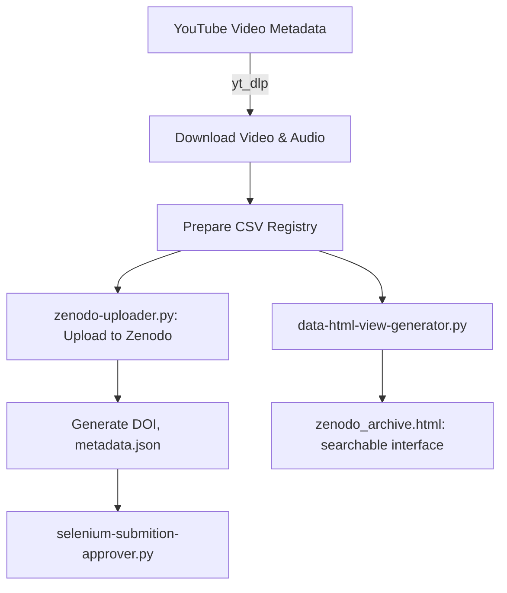

# The Sarvāmnāya Oral Tradition Archive
## A Research Repository of Guru-Paramparā Transmissions

*Source: Vimarsha Foundation Media* 
*License: Creative Commons Attribution 4.0 International (CC BY 4.0)*  
*Archive Collection: Sarvāmnāya Oral Tradition Archive*  
*Zenodo Community: sarvamnaya-oral-tradition-archive*

* **SEE THE ARCHIVE HERE:** https://dgrmunch.github.io/Sarvamnaya-Oral-Tradition-Archive-Tools/zenodo_archive.html

### Description:
------------

This is an initiative to preserve and provide open access to the Sarvāmnāya Oral Tradition as well as related talks and interviews originally published on the Vimarsha Foundation YouTube channel. A variety of video materials have been downloaded, processed, and deposited in Zenodo for long-term archival and scholarly citation.

* The content focuses on Tantric practices and philosophy within the framework of the Sarvāmnāya Saṃpradāya.

* DOI and citation information is provided with each file.

* If you use this material in academic or creative work, please cite the Zenodo record and acknowledge accordingly Āchāryaji Staneshwar Timalsina and the Vimarsha Foundation.


# 🕉️ The Sarvāmnāya Oral Tradition Archive: Tools

This code base includes a reproducible digital pipeline for archiving oral transmissions from the Vimarsha Foundation’s YouTube channel into Zenodo, forming a searchable, citable, and preservation-ready repository for the Sarvāmnāya Tantric tradition.

---

## 📦 Overview

This repository contains Python scripts and helper resources for:

- 🧠 Extracting metadata and video/audio from YouTube
- ☁️ Uploading processed material to [Zenodo](https://zenodo.org/)
- 📄 Generating HTML and BibTeX-based archives for scholarly citation
- 🧪 Automating acceptance of Zenodo draft uploads via Selenium

---

## 📚 Archive Use Case

**Primary Source:** [Vimarsha Foundation YouTube Channel](https://www.youtube.com/@VimarshaFoundation)  
**Archive Target:** [Sarvāmnāya Oral Tradition Archive on Zenodo](https://zenodo.org/communities/sarvamnaya-oral-tradition-archive)

The archive includes teachings, interviews, and discourses with a focus on Tantric sādhanā and philosophy.

---

## 🧪 Pipeline Architecture



---

## 🧰 Key Scripts

### `zenodo-uploader.py`

Handles:

- Parsing the `zenodo_registry.csv`
- Authenticating with Zenodo using a user-provided access token
- Uploading video/audio files and metadata
- Generating draft records (including community, license, contributors)
- Creating `metadata.json` to match Zenodo’s deposit schema
- Error handling for duplicate uploads
- YouTube API, ffmpeg, and yt_dlp are used for videos to be downloaded, processed and listed in the registry.

### `selenium-submition-approver.py`

Automates submission review on Zenodo for each deposit using:

- 🧭 [Selenium](https://www.selenium.dev/): headless browser automation
- 📋 Reads the submission list and clicks through each draft record to “Accept” it

### `data-html-view-generator.py`

- Builds a full HTML archive of Zenodo entries using the CSV file
- Outputs `zenodo_archive.html`, including:
  - Title, author, description, DOI, and BibTeX
  - A filterable, sortable table for scholarly navigation

---

## 📄 Citation Format (BibTeX)

Example entry:

```bibtex
@misc{timalsina_2023_15202748,
  author       = {Staneshwar Timalsina},
  title        = {Acharya Sthaneshwar's Message for Giving Tuesday},
  month        = {nov},
  year         = {2023},
  publisher    = {Zenodo},
  doi          = {10.5281/zenodo.15202748},
  url          = {https://doi.org/10.5281/zenodo.15202748}
}
```

---

## 📁 File Structure

```bash
.
├── zenodo_registry.csv              # Master metadata registry
├── zenodo-uploader.py              # Uploads to Zenodo
├── selenium-submition-approver.py # Automates Zenodo review
├── data-html-view-generator.py    # Builds HTML archive
├── zenodo_archive.html            # Generated searchable interface
├── zenodo-draft-delete.py         # [WIP] Delete Zenodo drafts
├── logo.png                       # Logo for HTML view
├── LICENSE                        # GPLv3
└── README.md
```

---

## ⚙️ Setup

### Requirements

```bash
pip install requests selenium pandas
```

Selenium requires the appropriate driver (e.g. `chromedriver`) in your PATH.

### Zenodo Token

Create a `ZENODO_TOKEN` environment variable:

```bash
export ZENODO_TOKEN='your_access_token_here'
```
... same with Youtube API, etc..
---

## 🌐 Outputs

- 🎞️ Zenodo records with DOIs and rich metadata
- 🔊 Audio-only versions for low-bandwidth access
- 📚 HTML and BibTeX citation-ready archive
- 🧾 CSV registry for reproducibility

---

## 🌱 Philosophy

This pipeline embodies the ethos of oral tradition preservation for scholarly and spiritual communities. Rather than commodifying sacred knowledge, it facilitates respectful citation and transparent access within the tantric Guru-Śiṣya context.

---

## 👤 Attribution

All content is © [Vimarsha Foundation](https://vimarshafoundation.org)
---

## 📜 License

This repository is licensed under the GNU GPL v3.  
Media content is released under [CC BY 4.0](https://creativecommons.org/licenses/by/4.0/)

---

## 🔗 Related Links

- 🔗 [Vimarsha Foundation](https://vimarshafoundation.org)
- 🎓 [Zenodo Community](https://zenodo.org/communities/sarvamnaya-oral-tradition-archive)
- 📺 [YouTube Channel](https://www.youtube.com/@VimarshaFoundation)

---
